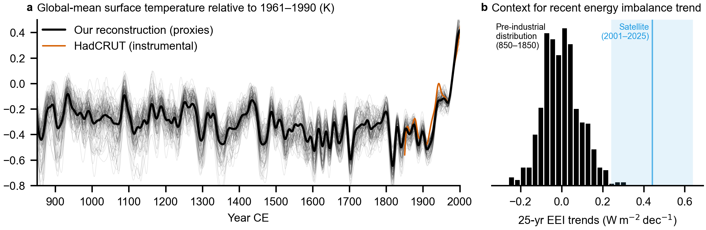

# Last-millennium energy-budget reconstruction from proxies

This repository hosts the code for the following paper:

> Stiller, D. and Hakim, G. J. (2026). "Top-of-atmosphere radiation over the last millennium reconstructed from proxies." *Journal of Climate*. https://doi.org/10.1175/JCLI-D-25-0568.1

For a detailed description of the algorithms used for the reconstruction (LIM, EnKF, PSMs), refer to the supplement. The reconstruction data and a snapshot of this code are archived on Zenodo (https://doi.org/10.5281/zenodo.21088397). The corresponding author is Dominik Stiller (dstiller@uw.edu).

## Abstract
Earth's energy imbalance at the top of the atmosphere is a key climate system metric, but its natural variability is poorly constrained by the short observational record and large uncertainty in coupled climate models. While existing ocean heat content reconstructions offer a longer perspective, they cannot separate the contributions of shortwave and longwave radiation, obscuring the underlying processes. We extend the energy-budget record into the pre-industrial period by reconstructing the top-of-atmosphere radiation and related surface variables over the last millennium (850–2000 CE) using data assimilation, combining proxy data and dynamics from a coupled climate emulator. Validation reveals skill in the reconstructed radiation fields, especially in the global mean and the tropics. We find that the well-documented last-millennium cooling trend coincides with persistent energy loss, largest early in the millennium, and a reduction in upper-ocean heat content. The cooling trend differs by season and latitude, and is associated with anomalies in outgoing longwave radiation suggestive of an eastward shift in Indo–Pacific convection. Following large volcanic eruptions, ocean heat content anomalies persist for 10–20 years on average, supporting previous evidence that multidecadal cooling was forced by decadally paced eruptions. The reconstruction also reveals that the current rate of energy gain is unprecedented relative to the period before 1850.

## Code structure
 * `lmrecon/`: Reconstruction code
   * `lmrecon/scripts/`: Executable scripts (see "Running the reconstruction" below)
   * `lmrecon/reconstruction.py`: Entry point for all reconstructions
   * `lmrecon/da.py`: Implements online data assimilation
   * `lmrecon/kf.py`: Implements ensemble Kalman filter (EnKF)
   * `lmrecon/lim.py`: Implements linear inverse model (LIM)
   * `lmrecon/psm.py`: Implements proxy system models (PSM)
   * `lmrecon/mapper.py`: Implements physical space–EOF space mapper
 * `notebooks/`: Analysis and prototyping notebooks
   * `notebooks/figures_StillerHakim2026.ipynb`: Figures for Stiller & Hakim (2026)
 * `jobs/`: PBS jobs for NCAR HPC
 * `pyproject.toml`: Python environment configuration, uses Pixi as package manager

## Running the reconstruction
*This list does not include comprehensive instructions to reproduce the results; rather, it serves as an outline of the process. All scripts are located in `lmrecon/scripts/`. For some steps, PBS job scripts are available in `jobs/`.*
1. Install the [Pixi package manager](https://pixi.sh/dev/), then run `pixi install`.
2. Modify `get_*_path()` in `lmrecon/util.py` to point to your local directories.
3. Download the CMIP6 past1000 simulations from ESGF (e.g., using [esgpull](https://github.com/ESGF/esgf-download/tree/main)).
4. Download the proxy data (e.g., Pages2k or CoralHydro2k).
5. Download the instrumental PSM calibration data (e.g., GISTEMP and ERSST).
6. Update the `intake-esm` catalog to include the downloaded CMIP6 simulations using `update_intake_catalog.py`.
7. Compute seasonal, detrended anomalies using `compute_seasonal_averages.py`, then `compute_seasonal_anomalies.py`, then `compute_seasonal_detrended_anomalies.py`. This also regrids the simulations to the common 2°×2° grid.
8. Fit the mapper from the physical space to the EOF space using `fit_mapper.py`. This also produces the LIM training data.
9. Regrid and seasonally average the instrumental calibration data using the commented-out code in `datasets.py`.
10. Combine the proxy databases using `assemble_pdb.py`. This also removes duplicates.
11. Remove proxies that are not temperature-sensitive using `remove_non_temperature_proxies.py`.
12. Calibrate the PSMs using `calibrate_psms.py`. This excludes proxies that have insufficient calibration correlations.
13. Compute the sea ice concentration climatology using `compute_hybrid_siconc_climatology.py`. This requires the multi-model mean of siconc from historical simulations.
14. Run the reconstruction using `run_reconstruction_allproxies.py` (assimilates all proxies) or using `run_reconstruction_single.py` (assimilates a subset of proxies for Monte Carlo iterations). This produces the reconstruction in EOF space.
15. Postprocess the reconstruction using `postprocess_reconstruction.py`. This maps the reconstruction from EOF space into the physical space and computes averages. If used in the previous step, multiple Monte Carlo iterations can be combined using `postprocess_reconstruction_mc.py`.
16. Analyze the reconstruction, e.g., based on `notebooks/figures_StillerHakim2026.ipynb`.

## Multi-prior reconstructions
For each model prior (CMIP6 simulation used to train the LIM), the following steps need to be repeated: compute anomalies, fit mapper, calibrate PSMs, run reconstruction. We use the following five model priors:
 * `MPI-ESM1-2-LR past2k`: available on ESGF (http://doi.org/10.22033/ESGF/CMIP6.14211)
 * `MRI-ESM2-0 past1000`: available on ESGF (http://doi.org/10.22033/ESGF/CMIP6.6866)
 * `MIROC6-ES2L past1000`: available on ESGF (http://doi.org/10.22033/ESGF/CMIP6.5666)
 * `CESM2-WACCM-FV2 past1000`: available from NCAR (https://doi.org/10.26024/5dgt-qf16)
   * Note that these simulations have [an issue](https://bb.cgd.ucar.edu/cesm/threads/spurious-1750-discontinuity-and-pre-industrial-warming-trend-in-cesm2-past1000-due-to-emission-file-date-stamps.12231/) with tropospheric aerosol emissions, which may also impact data assimilation results with this model as prior
 * `EC-Earth3-Veg-LR past1000`: pers. comm. with Qiong Zhang (SU); version published on ESGF (20241230) has issues with volcanic forcing implementation
